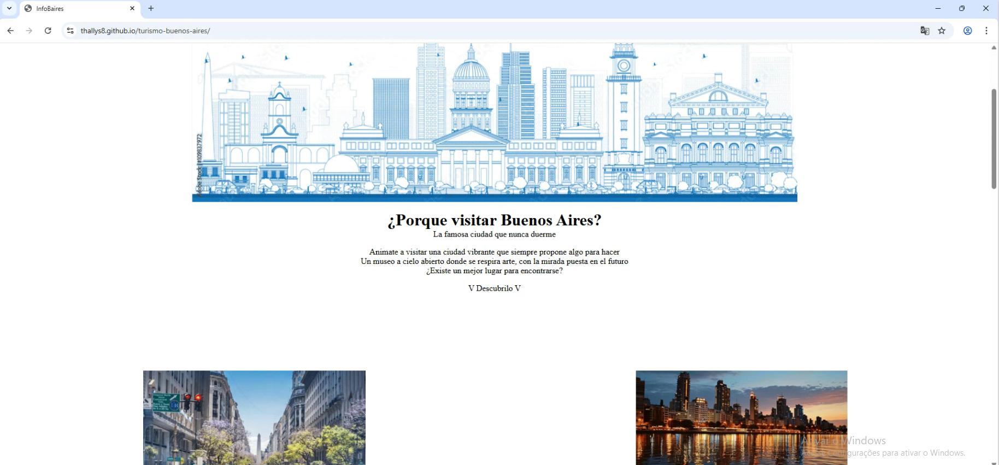
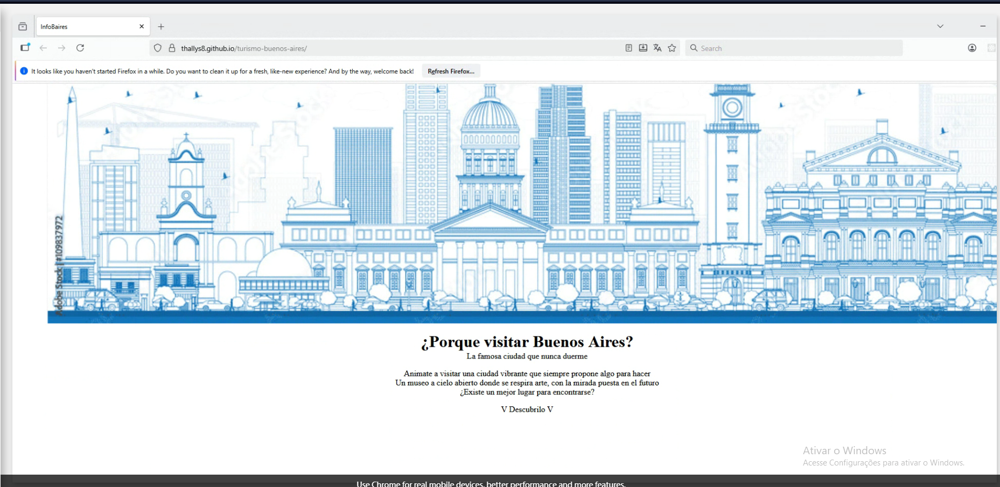
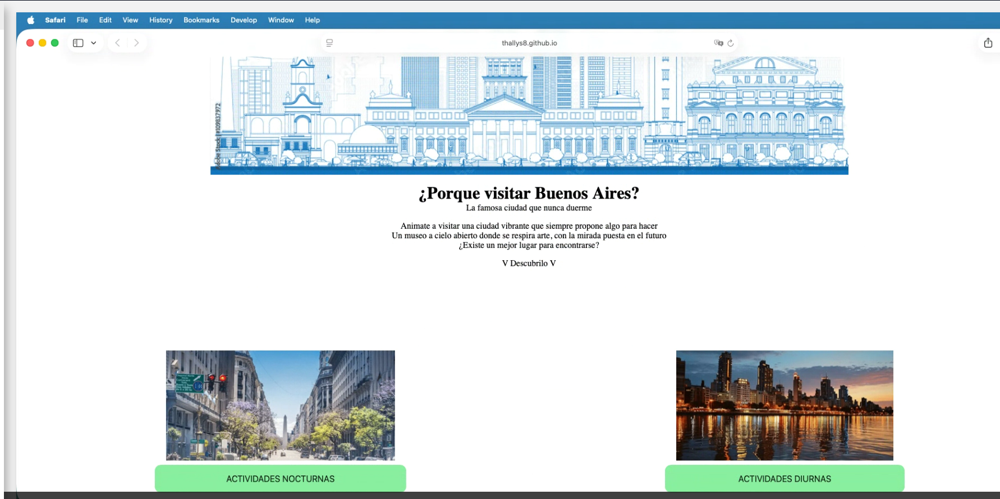
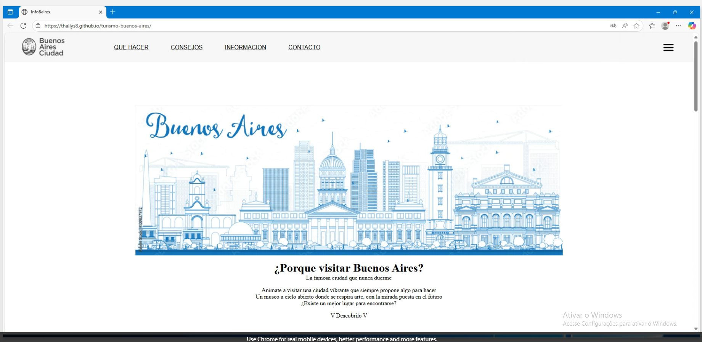
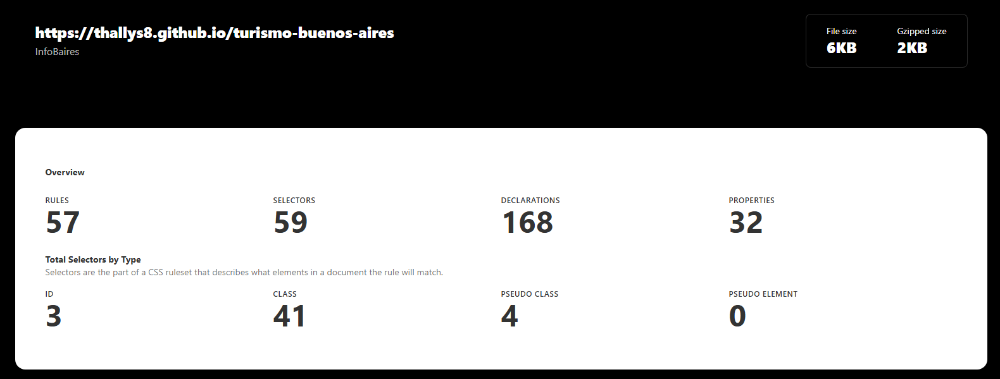
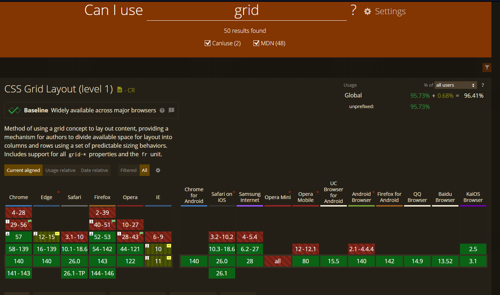
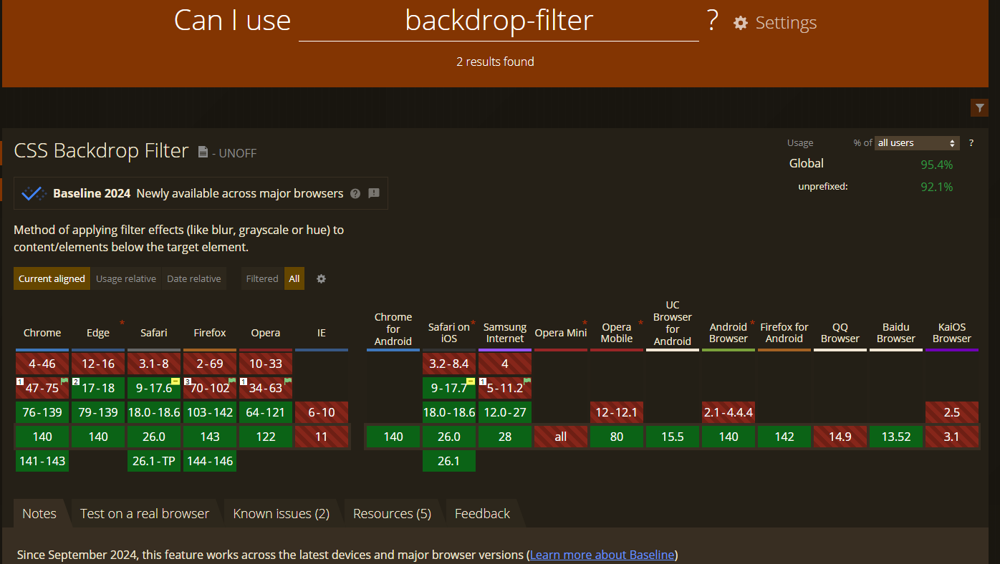
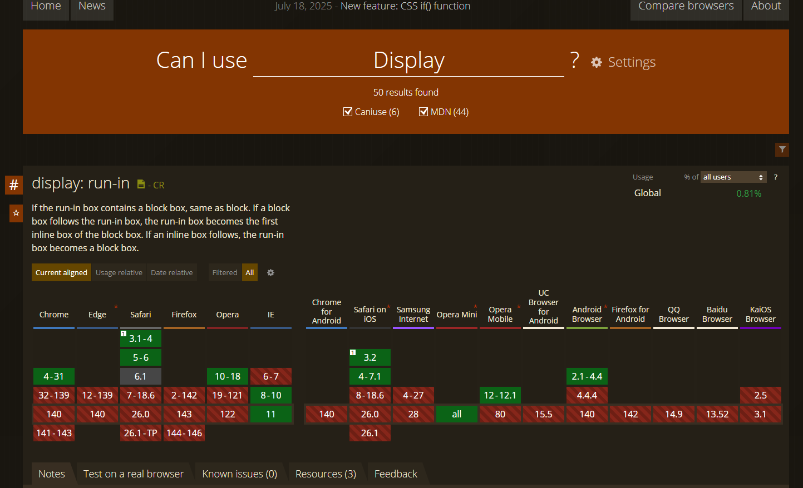

# Test Case 1: Compatibilidad Navegadores Desktop

## Objetivo
Verificar la correcta visualización y funcionalidad en navegadores desktop principales.

## Herramientas Utilizadas
- BrowserStack Live Testing
- Can I Use Database
- CSS Stats

## Navegadores Probados
| Navegador | Versión | OS | Resultado |
|-----------|---------|----|-----------|
| Chrome | 140 | Windows 11 | ✅ |
| Firefox | [143] | Windows 11 | ✅ |
| Safari | 5.1 | macOS | ✅ |
| Edge | 140 | Windows 11 | ✅ |

## Capturas de Pantalla
### Chrome

### Firefox

### Safari

### Edge

## Issues Encontrados
[Documentar problemas específicos con soluciones implementadas]

## Métricas de Compatibilidad (por navegador)

**Definición:**  
Se calcula en base al total de propiedades únicas de CSS detectadas con **CSS Stats** (`TotalProps`).  
Para cada navegador, se cuentan las propiedades soportadas según **Can I Use** (`CompatibleProps`).  

**Fórmula:**  
Compatibilidad CSS (por navegador) = (CompatibleProps / TotalProps) * 100

### Evidencias Requeridas
1. **Captura de CSS Stats** mostrando `TotalProps`.  
   

2. **Capturas de 4 propiedades consultadas en Can I Use** (una por imagen), indicando si están soportadas en cada navegador.  
   - `grid`  
   - `flexbox`  
   - `backdrop-filter`  
   - `position: sticky`  

   Ejemplo de evidencia:  
     
     
     
     

### Tabla de Resultados
| Navegador | TotalProps | CompatibleProps | Compatibilidad CSS |
|-----------|------------|-----------------|---------------------|
| Chrome | 32 | 31 | [31/32 * 100]% |
| Firefox | 32 | 31 | [31/32 * 100]% |
| Safari | 32 | 31 | [31/32 * 100]% |
| Edge | 32 | 31 | [31/32 * 100]% |

> Nota: Esta métrica es **por navegador**, ya que el soporte de propiedades CSS varía entre ellos.
