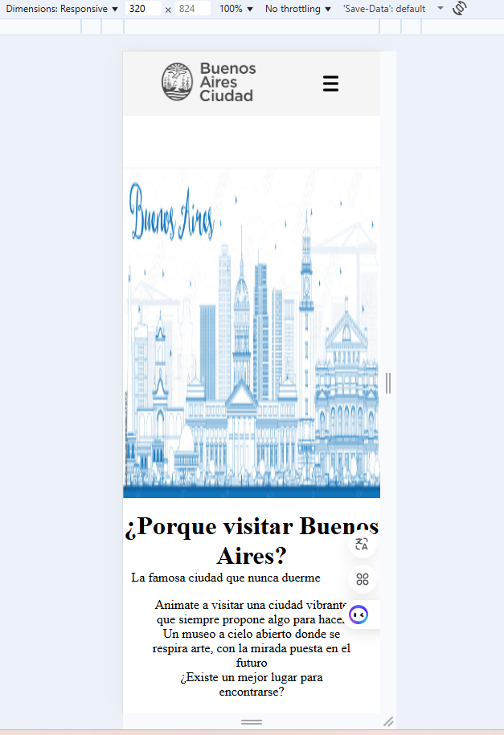

# Test Case 2: Testing Responsive Móviles

## Objetivo
Verificar la adaptabilidad responsive en dispositivos móviles reales

## Herramientas Utilizadas
- BrowserStack Real Device Testing
- Chrome DevTools Device Simulation

## Dispositivos Probados
| Dispositivo | Resolución | Navegador | Orientación | Resultado |
|-------------|------------|-----------|-------------|-----------|
| iPhone 14 Pro | 393x852 | Safari | Portrait/Landscape | ✅/❌ |
| Galaxy S23 | 360x780 | Chrome | Portrait/Landscape | ✅/❌ |
| iPad Air | 820x1180 | Safari | Portrait/Landscape | ✅/❌ |

## Breakpoints Verificados
- Mobile Portrait:
  
- Mobile Landscape:
  
  
- Tablet Portrait:
  
- Tablet Landscape:
  
  
- Desktop Portrait:
  
- Desktop Landscape:
  

## Capturas por Dispositivo
[Incluir capturas en portrait y landscape para cada dispositivo]

## Media Queries Validadas
[Lista de media queries CSS probadas exitosamente]
