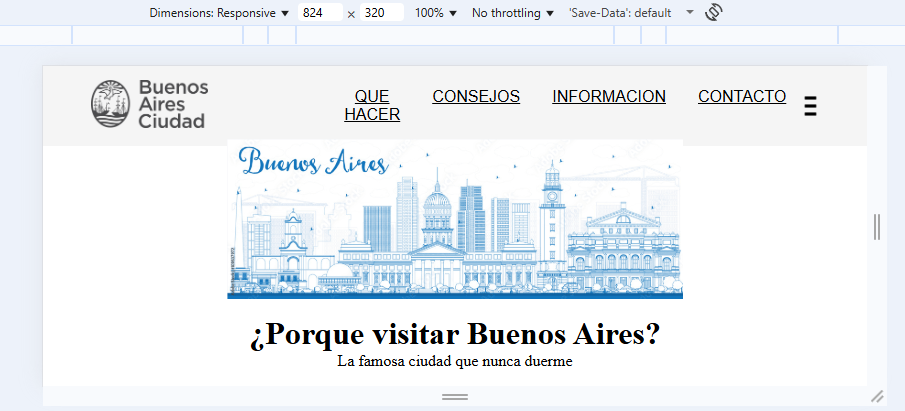
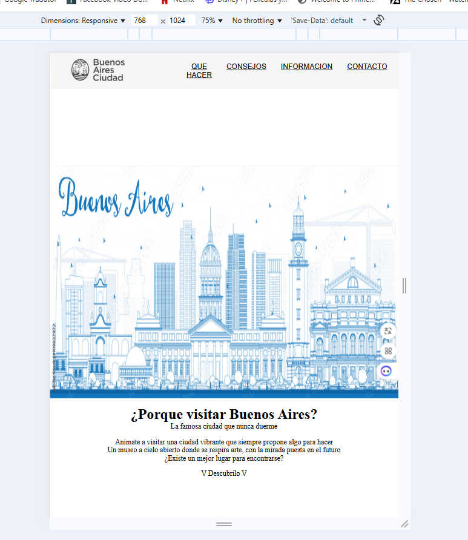
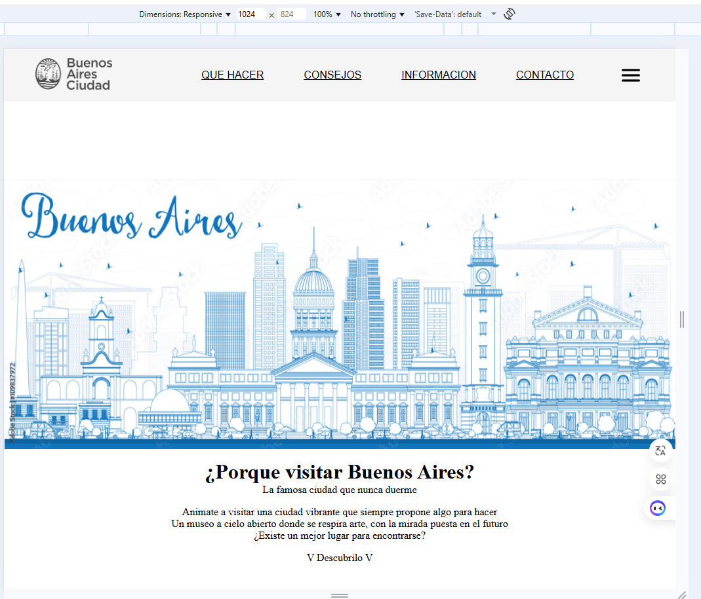
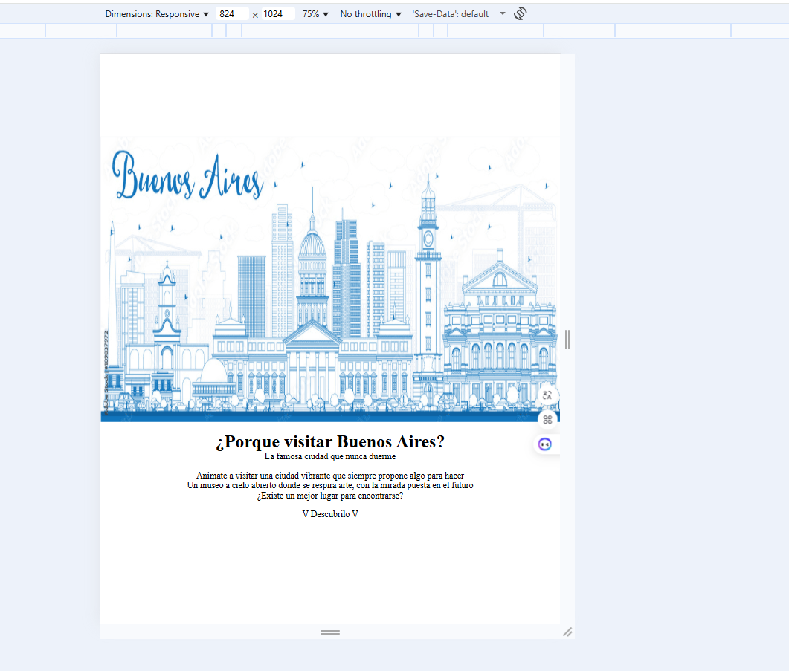

# Test Case 2: Testing Responsive Móviles

## Objetivo
Verificar la adaptabilidad responsive en dispositivos móviles reales

## Herramientas Utilizadas
- BrowserStack Real Device Testing
- Chrome DevTools Device Simulation

## Dispositivos Probados
| Dispositivo | Resolución | Navegador | Orientación | Resultado |
|-------------|------------|-----------|-------------|-----------|
| iPhone 14 Pro | 393x852 | Safari | Portrait/Landscape | ❌ |
| Galaxy S23 | 360x780 | Chrome | Portrait/Landscape | ❌ |
| iPad Air | 820x1180 | Safari | Portrait/Landscape | ❌ |

## Breakpoints Verificados
- Mobile: 320px - 768px  
- Tablet: 768px - 1024px  
- Desktop: 1024px+  

## Capturas por Dispositivo

#### iPhone 14 Pro:  
- Portrait:
  
  
- Landscape:  
  
  

#### Galaxy S23:  
- Portrait:
  
  
- Landscape:  
  
  

#### iPad Air:  
- Portrait:
  
  
- Landscape:  
  
    

- Mobile Portrait:  
  
- Mobile Landscape:  
  
  
- Tablet Portrait:  
  
- Tablet Landscape:  
  
  
- Desktop Portrait:  
  
- Desktop Landscape:  
  

## Media Queries Validadas
[Lista de media queries CSS probadas exitosamente]
