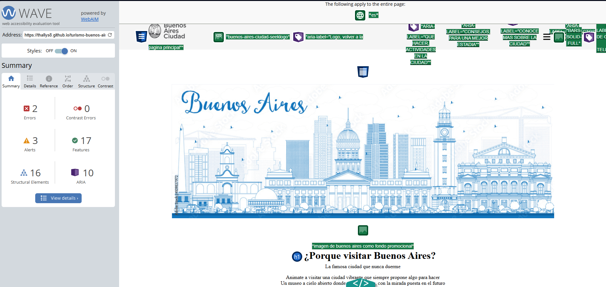
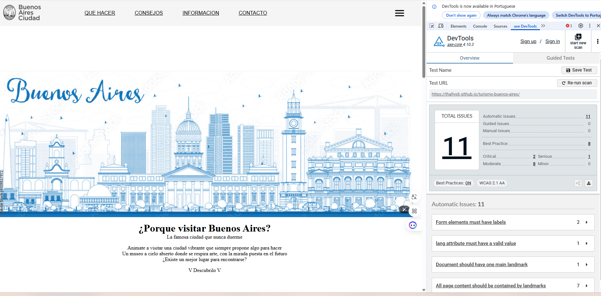
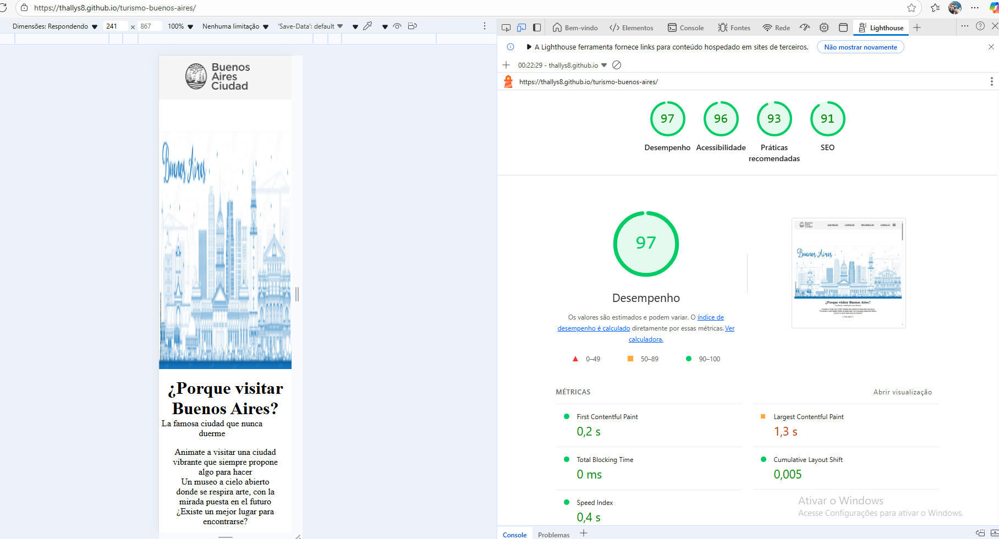

# Test Case 4: Accesibilidad Web (WCAG 2.1)

## Objetivo
Verificar el cumplimiento de estándares de accesibilidad WCAG 2.1 AA

## Herramientas Utilizadas
- WAVE Web Accessibility Evaluator
- axe DevTools Extension
- Lighthouse Accessibility Audit

## Resultados WAVE
- **Errores:** 2
- **Alertas:** 3  
- **Características:** 17
- **Elementos Estructurales:** 16
- **ARIA:** 10

### Captura WAVE Report

## Resultados axe DevTools
- **Violations:** 11
- **Needs Review:** 2
- **Passes:** 8

### Captura Resultados axe DevTools

## Lighthouse Accessibility Score
- **Puntuación:** 97/100

## Tests Manuales Realizados
- ❌ Navegación completa por teclado
- ✅ Contraste de colores adecuado
- ✅ Texto alternativo en imágenes
- ✅ Etiquetas de formularios correctas
- ✅ Estructura semántica HTML

## Issues de Accesibilidad Encontrados  
#### WAVE  
Los errores encontrados son por funcionalidades de los botones, algo que está sucediendo porque todavía no está implementado Java Script.  

#### axe DevTools  
Los issues grabes encontrados son por funcionalidades de los botones, algo que está sucediendo porque todavía no está implementado Java Script.  
El error serio captado está relacionando con el idioma del nombre de una imagen que no pudo traducirse correctamente.  

#### Lighthouse Accessibility  
Identificamos que algunas imágenes están con tiempo alto para cargar en pantallas grandes, el problema no sucede en pantallas chicas.  

#### Tests Manuales
La navegación por teclado no está funcionado de manera completa porque los botones dependen de la implementación futura de Java Script. 

## Optimizaciones Implementadas
Se diseño e implemento una barra de navegacion superior que, una vez configurado por js, permitiria la navegacion de la web
Issue relacionada: #47

