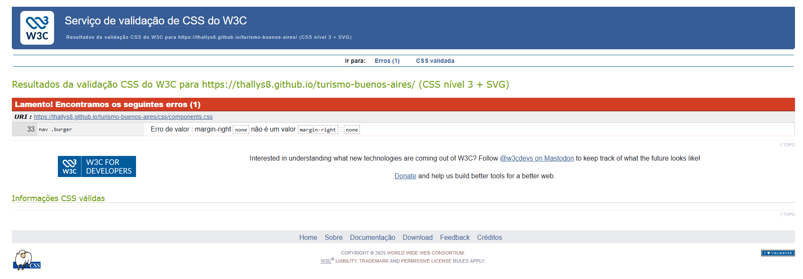
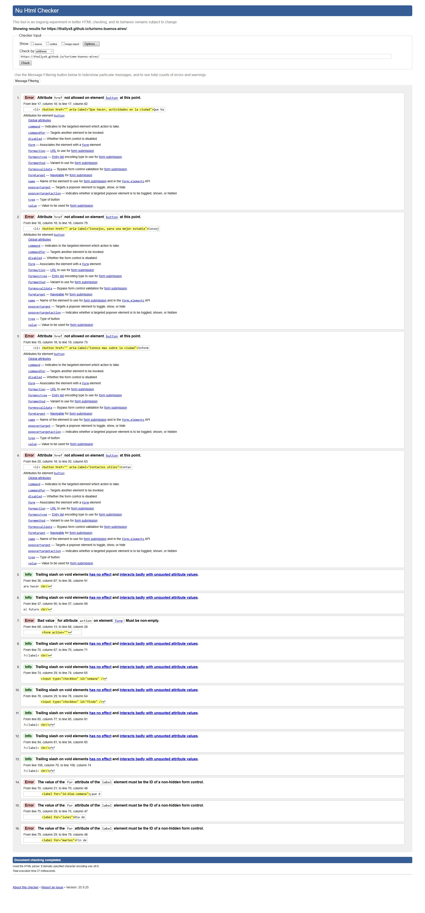

# Test Case 5: Cross-Platform y Validación CSS/HTML

## Objetivo
Verificar compatibilidad cross-platform y validar código CSS/HTML

## Herramientas Utilizadas
- LambdaTest Real Time Testing
- W3C CSS Validator
- W3C HTML Validator

## Testing Cross-Platform

### Windows 11
| Navegador | Versión | Resultado | Observaciones |
|-----------|---------|-----------|---------------|
| Chrome | 140 | ✅ |  El problema de compatibilidad encontrada fue la deformación del imagen de la taba cuando reducimos las dimensiones de la ventana |
| Firefox | 143 | ✅ |  El problema de compatibilidad encontrada fue la deformación del imagen de la taba cuando reducimos las dimensiones de la ventana |
| Edge | 141 | ✅ |  El problema de compatibilidad encontrada fue la deformación del imagen de la taba cuando reducimos las dimensiones de la ventana |

### macOS
| Navegador | Versión | Resultado | Observaciones |
|-----------|---------|-----------|---------------|
| Safari | 26 | ✅ | El problema de compatibilidad encontrada fue la deformación del imagen de la taba cuando reducimos las dimensiones de la ventana |
| Chrome | 140 | ✅ | El problema de compatibilidad encontrada fue la deformación del imagen de la taba cuando reducimos las dimensiones de la ventana |
| Firefox | 143 | ✅ | El problema de compatibilidad encontrada fue la deformación del imagen de la taba cuando reducimos las dimensiones de la ventana |

### Linux (Ubuntu)
| Navegador | Versión | Resultado | Observaciones |
|-----------|---------|-----------|---------------|
| Firefox | 143 | ❌ | No fue posible hacer la prueba desde lambdatest.com o browserstack.com. No encontramos outra página para realizar esta prueba |
| Chrome | 140 | ❌ | No fue posible hacer la prueba desde lambdatest.com o browserstack.com. No encontramos outra página para realizar esta prueba |

## Validación W3C

### CSS Validation Results
- **CSS Validator:** ❌ 1 error
- **Warnings:** 0

### HTML Validation Results
- **HTML Validator:** ❌ 8 errores
- **Warnings:** 0

## Compatibilidad CSS Features
| CSS Features | Chrome | Edge | Firefox | Safari |
|----------|---------|----------|--------|--------|
| display: flex | ✅ | ✅ | ✅ | ✅ |
| display: grid | ✅ | ✅ | ✅ | ✅ |
| position: relative | ✅ | ✅ | ✅ | ✅ |
| margin | ✅ | ✅ | ✅ | ✅ |
| padding | ✅ | ✅ | ✅ | ✅ |
| width | ✅ | ✅ | ✅ | ✅ |
| height | ✅ | ✅ | ✅ | ✅ |
| font-family | ✅ | ✅ | ✅ | ✅ |
| font-size | ✅ | ✅ | ✅ | ✅ |
| font-weight | ✅ | ✅ | ✅ | ✅ |
| line-height | ✅ | ✅ | ✅ | ✅ |
| text-align | ✅ | ✅ | ✅ | ✅ |
| color | ✅ | ✅ | ✅ | ✅ |
| background-image | ✅ | ✅ | ✅ | ✅ |
| background-size | ✅ | ✅ | ✅ | ✅ |
| background-position | ✅ | ✅ | ✅ | ✅ |
| object-fit | ✅ | ✅ | ✅ | ✅ |
| border | ✅ | ✅ | ✅ | ✅ |
| border-radius | ✅ | ✅ | ✅ | ✅ |
| box-shadow | ✅ | ✅ | ✅ | ✅ |
| opacity | ✅ | ✅ | ✅ | ✅ |
| transition | ✅ | ✅ | ✅ | ✅ |
| cursor | ✅ | ✅ | ✅ | ✅ |

