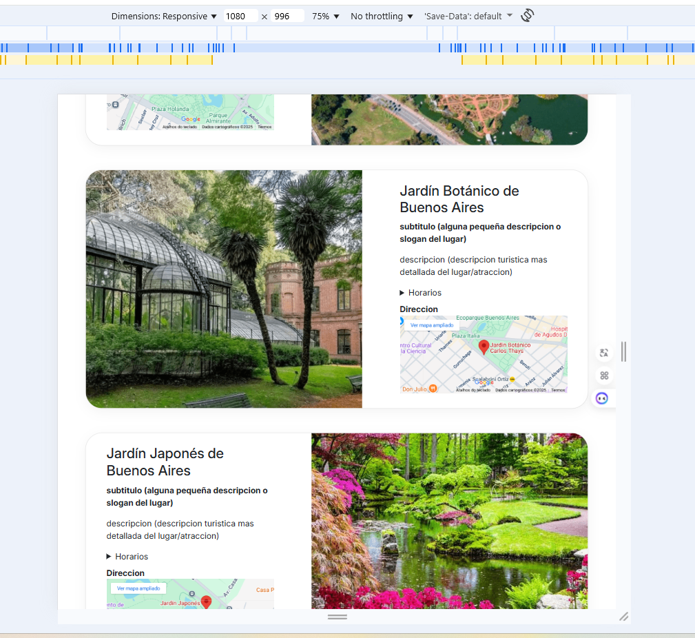
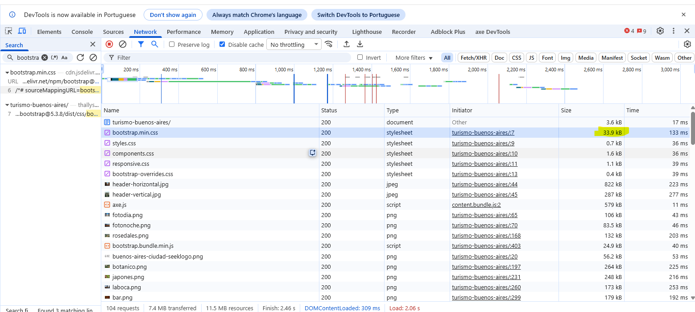

# Test Case 6: Responsive – Migración a Bootstrap

## Objetivo
Verificar la adaptabilidad responsive en dispositivos móviles, tablets y desktops tras la migración del proyecto a Bootstrap, asegurando que el diseño se mantenga coherente con el mockup `disenio-bootstrap.png`.

## Herramientas Utilizadas
- BrowserStack Real Device Testing
- Chrome DevTools Device Simulation
- Lighthouse / PageSpeed Insights

## Dispositivos Probados
| Dispositivo   | Resolución | Navegador | Orientación         | Resultado |
|---------------|------------|-----------|---------------------|-----------|
| iPhone 14 Pro | 393x852    | Safari    | Portrait/Landscape  | ✅ |
| Galaxy S23    | 360x780    | Chrome    | Portrait/Landscape  | ✅ |
| iPad Air      | 820x1180   | Safari    | Portrait/Landscape  | ✅ |

## Breakpoints Verificados
- **Mobile:** 320px – 768px  
- **Tablet:** 768px – 1024px  
- **Desktop:** 1024px+  

## Capturas por Dispositivo
- Incluir capturas en **portrait y landscape** para cada dispositivo probado.  
- Marcar en cada captura si la visualización coincide con el mockup `disenio-bootstrap.png`.

- #### iPhone 14 Pro:  
- Portrait:  
    
  
- Landscape:    
    

#### Galaxy S23:  
- Portrait:  
    
  
- Landscape:  
    

#### iPad Air:  
- Portrait:  
    

- Landscape:  
    

  
## Media Queries Validadas
-
    
    
    
   
    
      
 
- Otras media queries personalizadas presentes en `responsive.css`.  

- Mobile Portrait:  
  
- Mobile Landscape:  
  
  
- Tablet Portrait:  
  
- Tablet Landscape:  
  
  
- Desktop Portrait:  
  
- Desktop Landscape:  
  

---

## Sistema de Grillas de Bootstrap
### Validaciones
- Verificar que las clases `col-`, `col-sm-`, `col-md-`, `col-lg-`, etc. se adapten correctamente en cada resolución.  
- Confirmar que no haya **scroll horizontal no deseado en mobile**.  

### Capturas esperadas
1. **Mobile (iPhone 14 Pro, ~393px ancho)**  
   - Captura de una sección con distribución en **una sola columna (`col-12`)**.  
   - Confirmar ausencia de scroll horizontal.  
- Mobile Portrait:  
    
- Mobile Landscape:  
    
  
2. **Tablet (iPad Air, ~820px ancho)**  
   - Captura mostrando la **redistribución en 2 o 3 columnas (`col-md-*`)**.
   - 
- Tablet Portrait:  
    
- Tablet Landscape:  
    
  
3. **Desktop (>1024px)**  
   - Captura mostrando la distribución completa en múltiples columnas (`col-lg-*` o `col-xl-*`).  

- Desktop Portrait:  
    
- Desktop Landscape:  
    

---

## Performance en Mobile
### Validaciones
- Medir con **Lighthouse o PageSpeed** si no aumentó demasiado el tiempo de carga tras integrar Bootstrap.  
- Verificar el peso del **CSS cargado por CDN** y confirmar que no bloquee la renderización.  

### Capturas esperadas
1. **Reporte de Lighthouse / PageSpeed**  
   - Captura del resultado global (Performance, Accessibility, Best Practices, SEO).
   - Comparar resultados *antes y después* de la migración a Bootstrap.
     
   - Performance Mobile:  
     

   - Performance Desktop:  
   

2. **Detalle de recursos en Network (Chrome DevTools)**  
   - Captura mostrando el tamaño del archivo `bootstrap.min.css` cargado desde el CDN.  
       
   - Confirmar que no aparezca como recurso bloqueante en la columna "Blocking".  

---

## Resultado Esperado
- El layout debe adaptarse correctamente en **mobile, tablet y desktop** sin pérdida de coherencia visual.  
- No debe existir **scroll horizontal inesperado** en mobile.  
- El impacto en **performance** debe ser mínimo y el CSS de Bootstrap debe cargarse correctamente desde el CDN.

----
## Issues encontrados
Durante la ejecución de este test se detectaron los siguientes problemas, documentados en el repositorio:  

| IssueID | Descripción 
|----|-------------|
| [#58](https://github.com/Thallys8/turismo-buenos-aires/issues/58) | Problemas de performance causador por el cargamento de las imágenes en dispositivos mobile |
test-case-6.md

Mostrando test-case-6.md
