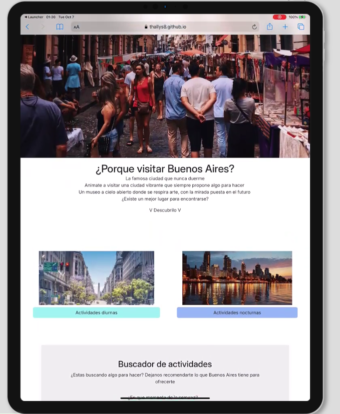

# Test Case 7: Responsive – Implementación de Componente Avanzado Bootstrap (Botón)

## Objetivo
Verificar la correcta integración, personalización y comportamiento responsive del primer componente avanzado de Bootstrap seleccionado el cual es bootstrap buttons en diferentes dispositivos y navegadores.

## Herramientas Utilizadas
- BrowserStack Mobile Testing  
- Chrome DevTools Device Mode  
- Google PageSpeed Insights  

## Dispositivos Probados
| Dispositivo       | Resolución | Navegador | Orientación         | Resultado |
|-------------------|------------|-----------|---------------------|-----------|
| iPhone 14 Pro     | 393x852    | Safari    | Portrait/Landscape  | ✅ |
| Galaxy S23        | 360x780    | Chrome    | Portrait/Landscape  | ✅ |
| iPad Air          | 820x1180   | Safari    | Portrait/Landscape  | ✅ |
| Desktop (Laptop)  | >1024px    | Chrome    | Landscape           | ✅ |

## Breakpoints Verificados
- **Mobile:** 320px – 768px  
- **Tablet:** 768px – 1024px  
- **Desktop:** 1024px+  

---

## Validaciones específicas
- Verificar que el componente se visualice correctamente en **mobile, tablet y desktop**.  ✅ El componente es responsive
- Confirmar que **no se produzca scroll horizontal indeseado** en mobile.  ✅  No se detecto scroll horizontal
- Validar que la **interacción (clic/touch)** funcione correctamente en dispositivos táctiles. ✅ se puede hacer click/touch comodamente
- Revisar que la personalización aplicada en `css/styles.css`, `css/components.css` y `css/bootstrap-overrides.css` mantenga la **identidad visual del proyecto**. ✅ Se mantuvo la identidad y colores

---

## Capturas esperadas
1. **Mobile (iPhone 14 Pro, portrait y landscape)** mostrando la versión adaptada del componente.  
2. **Tablet (iPad Air)** validando el comportamiento del componente en resolución intermedia.  
3. **Desktop** confirmando el comportamiento esperado con todas las funcionalidades activas.  
4. **DevTools → Performance & Network** mostrando que la integración del componente no afectó la performance ni cargó CSS/JS extra innecesario.

   - Mobile:  
     
     
   - Tablet:  
     
     
   - Desktop:  
     
     
   - Performance & Network:  
       
---

## Performance en Mobile
- Ejecutar **Google PageSpeed Insights** después de integrar el componente.  
- Comparar score con la versión sin el componente. 
- Captura del resultado global (Performance, Accessibility, Best Practices, SEO).  
- Comparar resultados *antes y después* de la incorporación del componente Bootstrap.   
- Confirmar que los recursos cargados no bloquean la renderización.

- Performance Antes: 
  

- Performance Despues:  
  

- Comparacion: Aunque inicialmente hubo una baja en performance al cargar los nuevos recursos de bootstrap, la implementacion de preload del cdn y la carga diferida del js le dieron una mejora sustancial. Junto a otras modificaciones, nos dieron una mejor performance en comparacion a la ultima version

- No se reportan elementos bloqueantes:  
  

---

## Resultado Esperado
- El componente se adapta correctamente en todos los dispositivos y resoluciones.  
- Mantiene coherencia visual y estilo definido en los archivos CSS del proyecto.  
- No genera problemas de performance ni bloqueos de carga.  

---

## Issues encontrados
Registrar aquí los problemas detectados y su correspondiente issue en el repositorio:  

| IssueID | Descripción 
|----|-------------|
| [#58](https://github.com/Thallys8/turismo-buenos-aires/issues/58) | Problemas de performance causador por el cargamento de las imágenes en dispositivos mobile |
