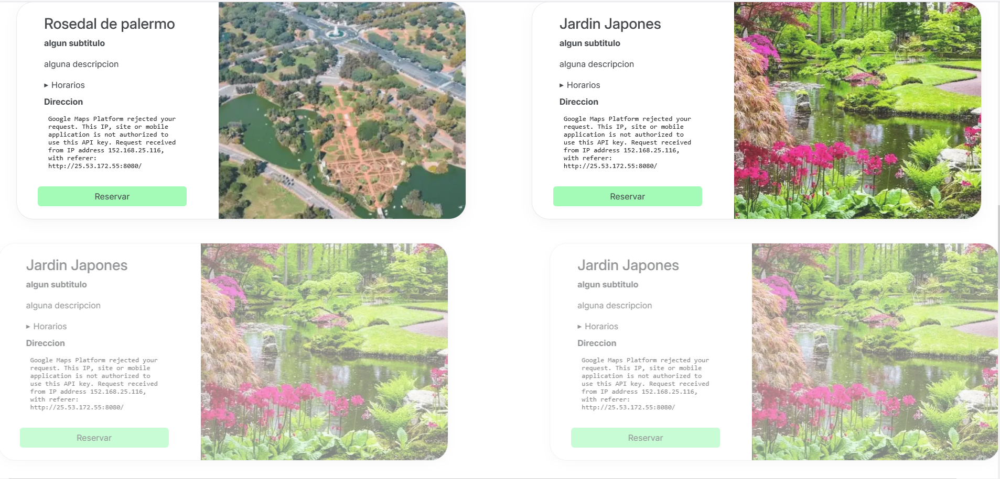
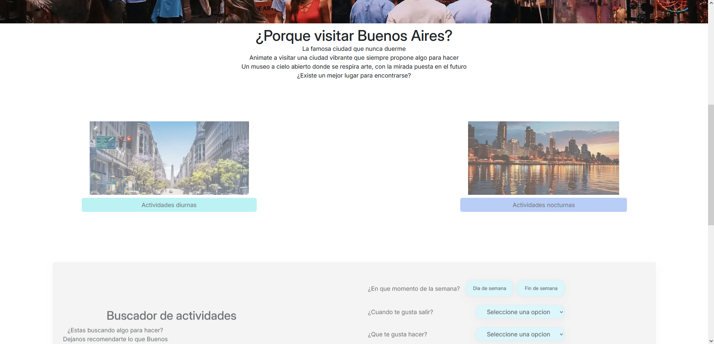

# Documentación de Librería Externa - AOS

## Información General
- **Nombre:** AOS (Animate On Scroll)
- **Versión:** 2.3.1
- **Repositorio:** https://github.com/michalsnik/aos

- **Documentación oficial:** https://github.com/michalsnik/aos/tree/v2

## Propósito y Justificación
Esta libreria fue seleccionada ya que actualmente nuestra pagina carece de cualquier tipo de animacion.
Por lo que al integrar esta libreria, facilmente se puede dar mas vida a la pagina y hacerla mas atractiva para los posibles turistas

## Instalación e Integración
### Método utilizado: CDN
```html
    <link href="https://unpkg.com/aos@2.3.1/dist/aos.css" rel="stylesheet">
    <script defer src="https://unpkg.com/aos@2.3.1/dist/aos.js"></script>
```
## Uso en el Proyecto
### Caso de Uso 1: Animacion de tarjetas de atracciones
Se integro AOS a las tarjetas de las atracciones para animarlas durante el scroll del usuario
Asignando las animaciones de forma intercalada izquierda -> derecha, luego derecha -> izquierda 
y asi repitiendo a medida que se generan nuevas tarjetas

```js
crearTarjetaHTML(atraccion, callbackReserva, fadeStyle){
    let elementoHTML = document.createElement("article");
    elementoHTML.className = "tarjeta col-6 container";
    elementoHTML.setAttribute("data-aos", fadeStyle);
    elementoHTML.setAttribute("data-aos-delay", "400");
    ...
}
crearAtracciones(){
    ...
    let fadeStyle = "fade-right";
    listaDatos.forEach( atraccion => {
        nuevasTarjetas.push( crearTarjetaHTML(atraccion, callbackReserva, fadeStyle) );
        fadeStyle = (fadeStyle === "fade-right") ? "fade-left" : "fade-right";
    });
    ...
}

```

### Caso de Uso 2: Animacion d menus y otros sistemas interactivos
Se integro tambien a los diferentes elementos interactivos en el sistema, asi a medida que el usuario los va descubriendo,
estos aparecen con una animacion de fade

```html
<section aria-label="selector de actividades diurnas o nocturnas" class="seleccion-dia-noche">
    <div data-aos="fade-right">
        ...
    </div>
    <div data-aos="fade-left">
        ...
    </div>
</section>

<section class="seleccion-actividades" data-aos="fade-up">
    ...
</section>

<section aria-label="newsletter y itinerario" class="container-fluid mb-4" data-aos="fade-up">
    ...
</section>
```
## Capturas de Pantalla

