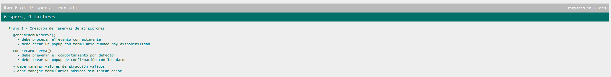
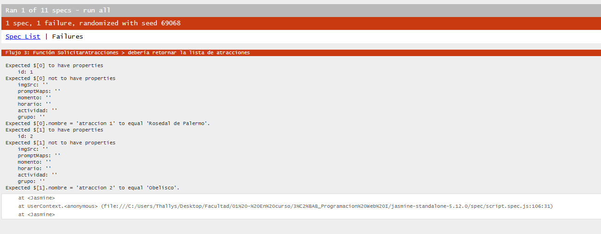
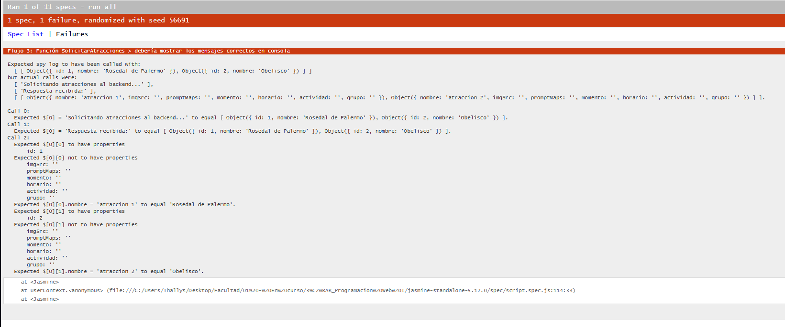

# Documentación de Testing - Suite Jasmine

## Índice
1. [Ejecución de Tests](#ejecución-de-tests)
2. [Suites de Tests](#suites-de-tests)
3. [Métricas de Cobertura](#métricas-de-cobertura)
4. [Capturas de Pantalla](#capturas-de-pantalla)
5. [Issues Conocidos](#issues-conocidos)

---

## Ejecución de Tests

### Pasos para Ejecutar
1. Abrir `test-runner.html` en el navegador
2. Los tests se ejecutan automáticamente
3. Verificar resultados en la interfaz de Jasmine

### Interpretación de Resultados
- **Verde**: Tests pasando ✅
- **Rojo**: Tests fallando ❌
- **Amarillo**: Tests pendientes ⚠️

---

## Suites de Tests

### Suite 1: Subscribir Newsletter
**Funciones Testeadas:**
- `[function SubscribirNewsletter()]` - Permite al usuario selecionar que tipo de NewaLetter él desea elegir.  

**Casos de Prueba:**
| # | Descripción | Tipo |
|---|-------------|------|
| 1 | Verifca se o Prompt está llamando al nombre correcto | Verificación de Llamada |
| 2 | Verifca se o Prompt está llamando a la vusqueda correcta | Verificación de Llamada |
| 3 | Verifca se o Prompt está llamando al correo correcto | Verificación de Llamada |
| 4 | Verifca se o Alert está llamado el mensaje correcto | Verificación de Llamada |
| 5 | Verifca se o Finalizar Supscricipon está llamado el mensaje correcto | Verificación de Llamada |

---

### Suite 2: Prompt Correo Electronico  
**Funciones Testeadas:**
- `[function PromptCorreoElectronico()]` - Permite al usuario ingresar un correo eletronico y verifica si es un formato de correo válido.  

**Casos de Prueba:**
| # | Descripción | Tipo |
|---|-------------|------|
| 1 | Verificar so el Prompt es correcto | Verificación de Llamada |
| 2 | Verificar si el menseje de error no fue enviado | Verificación de Llamada |
| 3 | Verificar si el Promt Conta solicita várias veces en caso de error | Comparación de Tipos Primitivos |
| 4 | Verificar si es un Email valido | Comparación de Tipos Primitivos |
| 5 | Verifica si el mensaje de Alerte fue enviado | Verificación de Llamada |
| 6 | Verificar si el es un Email valido | Comparación de Tipos Primitivos |
| 7 | Verifica si el mensaje es arojado nuvemanvte en veces incorrectas | Comparación de Tipos Primitivos |
| 8 | Verifica si el mensaje es arojado nuvemanvte en veces incorrectas | Comparación de Tipos Primitivos |
| 9 | Verificar si el es un Email valido | Comparación de Tipos Primitivos |

---

### Suite 3: Función SolicitarAtracciones  
**Funciones Testeadas:**
- `[function SolicitarAtracciones()]` - El sistema debe solicitar al Backend las atraciones didponibles. 

**Casos de Prueba:**
| # | Descripción | Tipo |
|---|-------------|------|
| 1 | Verifica si el Resultado es identico al exigiido | Comparación de Tipos Primitivos |
| 2 | Verifica si el consele envió a información al Backend | Verificación de Llamada |
| 3 | Verifica si el console responde devuelve la respuesta | Verificación de Llamada |
| 4 | Verifica si la la información de la atración | Verificación de Llamada |

---

### Suite 4: Función menuDeUsuario  
**Funciones Testeadas:**
- `[function menuDeUsuario()]` - Es el menu en donde el usuario puede interactuar con el sistema y selecionar que desea hacer en la pagina.  

**Casos de Prueba:**
| # | Descripción | Tipo |
|---|-------------|------|
| 1 | Verifica si el prompt retorna el valor correcto para el Case 1 | Verificación de Llamada |
| 2 | Verifica si el prompt retorna el valor correcto para el Case 2 | Verificación de Llamada |
| 3 | Verifica si el prompt retorna el valor correcto para el Case 3 | Verificación de Llamada |
| 4 | Verifica si el prompt retorna el valor correcto para el Case 4 | Verificación de Llamada |
| 5 | Verifica si el alerta retorna el valor correcto para Case no valido | Verificación de Llamada |

---

## Métricas de Cobertura

### Resumen General
| Métrica | Valor |
|---------|-------|
| Total de Tests | 23 |
| Tests Pasando | 19 ✅ |
| Tests Fallando | 4 ❌ |
| Porcentaje de Éxito | 82,6% |

### Cobertura por Tipo de Test
| Tipo | Cantidad | Porcentaje |
|------|----------|------------|
| Verificación de Llamada | 16 | 70% |
| Comparación de Tipos Primitivos | 7 | 30% |

### Análisis de Cobertura de Código

**Metodología:** Se revisó manualmente 4 funciones importantes del código fuente y se verificó qué líneas son ejecutadas por los tests implementados.

| Función | Líneas Totales | Tests | Líneas Cubiertas | Cobertura |
|---------|----------------|-------|------------------|-----------|
| `function SubscribirNewsletter()` | 245 | 1 | 16 | 6,5% |
| `function PromptCorreoElectronico()` | 245 | 2 | 12 | 4,9% |
| `function SolicitarAtracciones()` | 245 | 3 | 8 | 3,3% |
| `function menuDeUsuario()` | 245 | 4 | 31 | 12,6% |

**Cobertura Total Estimada:** 27,3% (67/245 líneas ejecutables)

#### Líneas NO Cubiertas
- `script.js:01-91` - No tuvimos tiempo para probar todas las funciones.
- `script.js:105-110` - No tuvimos tiempo para probar todas las funciones.
- `script.js:126-132` - No tuvimos tiempo para probar todas las funciones.
- `script.js:142-211` - No tuvimos tiempo para probar todas las funciones.
- `script.js:244-245` - No es una función

---

## Capturas de Pantalla

### Tests Pasando
  
  
  

### Vista Detallada de Suites
  
  

---

## Issues Conocidos

### Issue #[X]: [Título del Issue]
- **Severidad:** Alta
- **Suite Afectada:** `describe("Suite 3")`
- **Test Afectado:** `it("debería retornar la lista de atracciones")`
- **Test Afectado:** `it("debería mostrar los mensajes correctos en consola")`
- **Comportamiento Esperado:** Comunicarse con backend y renornar la lisa de atraciones. 
- **Comportamiento Obtenido:** No devuelve respuesta
- **Pasos para Reproducir:**
  1. Solicitar al Backend la lista de atraciones.
  2. Backend no devuelve información.

- **Código del Test que Falla:**
  ```javascript
  it('debería retornar la lista de atracciones', () => {
    const resultado = SolicitarAtracciones();
    expect(resultado).toEqual(AtraccionTuristicaMock);
  });

  it('debería mostrar los mensajes correctos en consola', () => {
    SolicitarAtracciones();
    expect(console.log).toHaveBeenCalledWith('Solicitando atracciones al backend...');
    expect(console.log).toHaveBeenCalledWith('Respuesta recibida:');
    expect(console.log).toHaveBeenCalledWith(AtraccionTuristicaMock);
  });
  
  ```
- **GitHub Issue:** #[número]
- **Estado:** Abierto

---

## Limitaciones del Testing
- Tests síncronos únicamente (sin Promises/async-await)
- Sin cobertura automatizada de código
- Requiere conexión a internet (CDN de Jasmine)
- No incluye tests de integración con DOM

---

**Última Actualización:** [24/10/2025]  
**Tester/QA Engineer:** [Thallys Leandro]  
**Colaboración con:** [Desarrollador JavaScript - Tomás Guardo]
