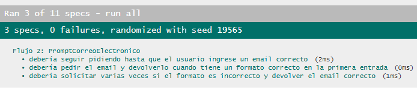
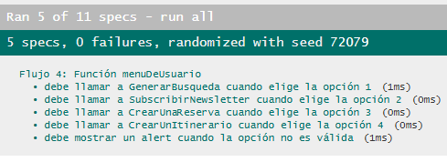

# Documentación de Testing - Suite Jasmine

## Índice
1. [Ejecución de Tests](#ejecución-de-tests)
2. [Suites de Tests](#suites-de-tests)
3. [Métricas de Cobertura](#métricas-de-cobertura)
4. [Capturas de Pantalla](#capturas-de-pantalla)
5. [Issues Conocidos](#issues-conocidos)

---

## Ejecución de Tests

### Pasos para Ejecutar
1. Abrir `SpecRunner.html` en el navegador
2. Los tests se ejecutan automáticamente
3. Verificar resultados en la interfaz de Jasmine

### Interpretación de Resultados
- **Verde**: Tests pasando ✅
- **Rojo**: Tests fallando ❌
- **Amarillo**: Tests pendientes ⚠️

---

## Suites de Tests

### Suite 1: Scripts
**Funciones Testeadas:**

#### Flujo 1 - handlerSubmitBusqueda()
- Debe procesar correctamente parámetros válidos
- Debe aceptar arrays vacíos como parámetros
- Debe manejar resultados sin atracciones mostrando mensaje apropiado
- Debe manejar parámetros null o undefined sin lanzar error
- Debe limpiar elementos anteriores antes de agregar nuevos
- Debe usar el filtro de atracciones para buscar

#### Flujo 2 - Suscripción a Newsletter
- Debe prevenir el comportamiento por defecto del formulario
- Debe procesar los datos del formulario
- Debe crear un popup de confirmación
- Debe aceptar un formulario con campos vacíos
- Debe manejar formularios sin checkboxes seleccionados
- No debe lanzar errores con valores básicos
- Debe extraer correctamente los datos del FormData

#### Flujo 3 - Creación de reservas de atracciones
##### generarMenuReserva()
- Debe procesar el evento correctamente
- Debe crear un popup con formulario cuando hay disponibilidad
##### concretarReserva()
- Debe prevenir el comportamiento por defecto
- Debe crear un popup de confirmación con los datos
- Debe manejar valores de atracción válidos
- Debe manejar formularios básicos sin lanzar error

#### Flujo 4 - Creación de Itinerario
##### generarItinerario()
- Debe ejecutarse sin lanzar errores
- Debe crear un popup con formulario de itinerario
##### almacenarDiaItinerario()
- Debe procesar el formulario sin errores
- Debe manejar la inicialización del itinerario
- No debe lanzar error al generar itinerario

**Casos de Prueba:**
| ## |                                                      Descripción                                                           |                     Tipo                      |
|----|----------------------------------------------------------------------------------------------------------------------------|-----------------------------------------------|
| 01 | Verifica que, al inicializar la página, se generen correctamente las tarjetas de atracciones en el contenedor del DOM.     | Happy path / integración DOM                  |
| 03 | Comprueba que las tarjetas creadas alternen correctamente las animaciones AOS (izquierda/derecha).                         | Lógica de presentación / integración con AOS  |
| 04 | Verifica que el handler de búsqueda llama `preventDefault()` y no recarga la página.                                       | Validación de comportamiento de formulario    |
| 05 | Comprueba que, al enviar el formulario, se invoca el filtro con los criterios seleccionados.                               | Lógica de negocio + integración DOM/modelos   |
| 06 | Valida que los resultados devueltos por `FiltroAtracciones` se representen en el DOM (lista o tarjetas filtradas).         | Happy path / integración DOM                  |
| 07 | Verifica que `concretarReserva` llame `preventDefault()` para evitar el envío nativo del formulario.                       | Validación de formulario / manejo de eventos  |
| 08 | Comprueba que, al guardar la reserva, se muestre en el DOM un popup o mensaje con los datos de la reserva.                 | Lógica de UI / integración DOM                |
| 09 | Simula un formulario de reserva estándar y verifica que `concretarReserva` no arroje excepciones.                          | Robustez / manejo de errores                  |
| 10 | Verifica que el formulario de itinerario construye correctamente el `FormData` y llama a `Itinerario.cargarDiaItinerario`. | Integración DOM/modelos / happy path          |
| 11 | Comprueba que, tras guardar un día, el texto “día en proceso” del DOM se actualiza al siguiente día.                       | Lógica de negocio + actualización de interfaz |
| 12 | Verifica que, al completar los 7 días, se muestre un mensaje o estado de itinerario completo en la interfaz.               | Caso de borde / integración DOM               |
| 13 | Comprueba que el formulario de newsletter evita el submit nativo y llama a `ConexionAlmacen.ingresarInformacionNewsletter`.| Integración DOM/modelo / validación           |
| 14 | Verifica que solo se procese el envío si el email cumple el formato válido (usando `Validador.esEmail`).                   | Validación de datos de entrada                |


---

### Suite 2: Modelos de POO
**Funciones Testeadas:**

#### FiltroAtracciones
- buscarAtracciones: devuelve array vacío sin coincidencias
- Se inicializa correctamente con método buscarAtracciones
- buscarAtracciones: filtra atracciones según criterios

#### Semana
- getDias: devuelve el día correcto según el índice
- getDias: devuelve todos los días en orden

#### Integración entre modelos
- Flujo completo: Buscar y crear reserva
- Itinerario usa Semana para controlar días
- FiltroAtracciones usa Validador para buscars

#### Reserva
- obtenerReserva: devuelve objeto con propiedades correctas
- guardarReserva: almacena correctamente los datos

#### Itinerario
- cargarDiaItinerario: agrega día al itinerario
- toJSON: devuelve JSON válido con propiedad 'datos'
- getItinerario: devuelve array de días cargados
- diaEnProceso: devuelve el siguiente día a cargar
- estaCompleto: valida correctamente cuando tiene 7 días

#### FiltroAtracciones
- buscarAtracciones: filtra atracciones según criterios
- Se inicializa correctamente con método buscarAtracciones
- buscarAtracciones: devuelve array vacío sin coincidencias

#### ConexionAlmacen
- ingresarInformacionReservas: acepta FormData sin error
- solicitarDisponibilidad: devuelve array de días
- solicitarInformacionAtracciones: devuelve objeto con datos array
- ingresarInformacionNewsletter: acepta FormData sin error
- ingresarInformacionItinerario: acepta Itinerario sin error

**Casos de Prueba:**
| ## |                                             Descripción                                                  |                    Tipo                      |
|----|----------------------------------------------------------------------------------------------------------|----------------------------------------------|
| 01 | Verifica que detecta correctamente cuando dos arrays comparten al menos un valor y cuando no.            | Lógica de negocio / happy path y negativo    |
| 02 | Valida distintos formatos de email (correcto, con doble @, sin @, vacío).                                | Validación de formato / casos negativos      |
| 03 | Comprueba que el índice 0 devuelve “lunes” y el 6 devuelve “domingo”.                                    | Lógica de negocio / caso de borde (extremos) |
| 04 | Recorre todos los índices y verifica que los días se devuelven en el orden esperado.                     | Lógica de negocio / happy path               |
| 05 | Guarda datos de una reserva creados desde un `FormData` y verifica que se almacenen correctamente.       | Happy path / persistencia de datos           |
| 06 | Tras guardar una reserva, verifica que el objeto devuelto tenga las propiedades esperadas.               | Lógica de negocio / estructura de datos      |
| 07 | Carga un día en el itinerario a partir de un `FormData` y verifica que se agregue al array interno.      | Happy path / lógica de negocio               |
| 08 | Verifica que inicialmente es falso y pasa a verdadero al cargar los 7 días de la semana.                 | Lógica de negocio / caso de borde (umbral)   |
| 09 | Comprueba que antes de cargar datos el día en proceso es “lunes” y luego avanza a “martes”.              | Lógica de negocio / flujo secuencial         |
| 10 | Verifica que devuelve un array con los días cargados (tipo y longitud correctos).                        | Happy path / estructura de datos             |
| 11 | Serializa el itinerario y valida que el JSON resultante tenga la propiedad `datos` como array.           | Serialización / validación de estructura     |
| 12 | Comprueba que la instancia se inicializa con `validador` y `conexionAlmacen` definidos.                  | Inicialización                               |
| 13 | Mockea la conexión y verifica que filtra las atracciones correctas según momento/horario/actividad/grupo.| Lógica de negocio / happy path               |
| 14 | Mockea datos que no matchean los criterios y verifica que devuelve un array vacío.                       | Lógica de negocio / caso negativo            |
| 15 | Verifica que el resultado esté definido y que sea un array (estructura básica de datos).                 | Validación de estructura / happy path        |
| 16 | Comprueba que la función devuelve un array de días para una atracción dada.                              | Lógica de negocio simple / estructura        |
| 17 | Si está implementado, verifica que acepta un `FormData` sin lanzar errores.                              | Robustez / validación de no error            |
| 18 | Si está implementado, verifica que acepta un objeto `Itinerario` sin lanzar errores.                     | Robustez / validación de no error            |
| 19 | Si está implementado, verifica que acepta un `FormData` de newsletter sin lanzar errores.                | Robustez / validación de no error            |
| 20 | Comprueba que la instancia de `FiltroAtracciones` contenga internamente un `Validador`.                  | Integración                                  |
| 21 | Verifica que `Itinerario` utilice internamente una instancia de `Semana`.                                | Integración                                  |
| 22 | ockea las atracciones, las busca con `FiltroAtracciones`, arma un formulario y guarda la `Reserva`.      | Integración / happy path                     |

---

### Suite 3: Storage
**Funciones Testeadas:**
####  StorageUtil
- Guarda y obtiene un objeto en localStorage
- Guarda y obtiene un string en sessionStorage
- Actualizar es equivalente a guardar
- Eliminar borra la clave del storage
- Listar devuelve solo las claves con el prefijo indicado
- Limpiar borra todas las claves del storage seleccionado
- Obtener devuelve null si el JSON está corrupto

**Casos de Prueba:**
| ## |                                                  Descripción                                                      |                         Tipo                         |
|----|-------------------------------------------------------------------------------------------------------------------|------------------------------------------------------|
| 01 | Guarda un objeto en `localStorage` y lo obtiene verificando que el resultado sea igual al objeto original.        | Happy path / lógica de negocio / persistencia        |
| 02 | Guarda un string en `sessionStorage`, espía `sessionStorage.setItem` y verifica que se haya llamado y leído bien. | Integración con API nativa / happy path / validación |
| 03 | Verifica que `actualizar(clave, valor, "local")` termine llamando internamente a `localStorage.setItem` con JSON. | Lógica interna / equivalencia con `guardar`          |
| 04 | Crea una clave en `localStorage`, llama a `eliminar(clave, "local")` y comprueba que `getItem` devuelva `null`.   | Lógica de negocio / happy path                       |
| 05 | Crea varias claves, algunas con un prefijo común, y verifica que `listar(prefijo, "local")` devuelva solo esas.   | Lógica de negocio / filtrado / caso positivo         |
| 06 | Carga varias claves en `localStorage`, ejecuta `limpiar("local")` y comprueba que el `length` quede en 0.         | Caso de limpieza total / lógica de negocio           |
| 07 | Inserta manualmente un string inválido en `localStorage` y verifica que `obtener(clave, "local")` devuelva `null`.| Manejo de errores / robustez ante datos corruptos    |

---

### Suite 4: API
**Funciones Testeadas:**
####  API de atracciones - js/api/atracciones.json
- Debe obtener las atracciones correctamente con fetch (respuesta exitosa)
- Debe manejar un error HTTP (por ejemplo 404) al pedir un recurso inexistente
- Debe manejar correctamente un error de red (fallo en fetch)
- Debe procesar los datos de atracciones usando map, filter y reduce correctamente
- Debe integrar los datos de atracciones en el DOM creando una lista de nombres

**Casos de Prueba:**
| ## |                                                        Descripción                                                            |                        Tipo                     |
|----|-------------------------------------------------------------------------------------------------------------------------------|-------------------------------------------------|
| 01 | Realiza un `fetch("/js/api/atracciones.json")`, parsea el JSON y verifica que `atracciones` exista y sea un array.            | Happy path / integración con API (fetch + JSON) |
| 02 | Intenta hacer `fetch` a un recurso inexistente (por ej. `recurso-inexistente.json`) y verifica que la respuesta no sea OK.    | Manejo de errores HTTP / validación de estado   |
| 03 | Simula o testea un caso en el que el `fetch` falle (rechazo de promesa) y comprueba que el código captura la excepción.       | Manejo de errores de red / robustez             |
| 04 | A partir del array de atracciones del JSON, usa `map/filter/reduce` para transformar/filtrar datos y valida el resultado.     | Lógica de negocio / procesamiento funcional     |
| 05 | Carga las atracciones desde el JSON y crea dinámicamente elementos del DOM (por ejemplo, una lista de nombres) y los verifica.| Integración DOM + datos remotos / happy path    |

---

### Suite 5: Library
**Funciones Testeadas:**
####  Librería AOS
- Inicializa AOS al cargar la aplicación
- Configura AOS con un objeto de configuración válido
- Permite ser llamado sin lanzar errores
- No rompe si AOS.init se llama múltiples veces
- Expone la función init en window.AOS
- No depende de elementos específicos del DOM para inicializar
- Se puede reconfigurar sin errores

**Casos de Prueba:**
| ## |                                                        Descripción                                                          |                     Tipo                     |
|----|-----------------------------------------------------------------------------------------------------------------------------|----------------------------------------------|
| 01 | Verifica que, tras cargar `script.js`, el mock de `AOS.init` haya sido llamado (`__AOS_INIT_CALLED__ === true`).            | Integración inicial / happy path             |
| 02 | Comprueba que `AOS.init` deje almacenado un objeto de configuración en `__AOS_CONFIG__` (aunque sea `{}` si no hay config). | Validación de configuración / robustez       |
| 03 | Verifica que `window.AOS` exista y que `AOS.init` sea una función.                                                          | Validación de librería global / wiring       |
| 04 | Llama manualmente a `AOS.init({ duration: 500 })` y comprueba que no arroje excepciones.                                    | Manejo de errores / happy path               |
| 05 | Verifica que se puede llamar a `AOS.init` varias veces seguidas sin que se produzcan errores.                               | Robustez / reconfiguración                   |
| 06 | Llama a `AOS.init` con la configuración disponible y comprueba que no dependa de que existan nodos concretos en el DOM.     | Integración con entorno / robustez           |
| 07 | Aplica dos configuraciones distintas consecutivas (`once`, `duration`, etc.) y verifica que no se generen errores.          | Lógica de reconfiguración / manejo de estado |

---

## Métricas de Cobertura

### Resumen General
| Métrica | Valor |
|---------|-------|
| Total de Tests | 65 |
| Tests Pasando | 65 ✅ |
| Tests Fallando | 0 ❌ |
| Porcentaje de Éxito | 100% |

******************** Parei aqui, tenho que terminar *****************


### Cobertura por Tipo de Test
| Tipo | Cantidad | Porcentaje |
|------|----------|------------|
| Funcionalidad Básica | 12 | 23% |
| Casos Borde | 8 | 15% |
| Validación de Errores | 10 | 19% |
| Operaciones con Arrays | 7 | 13% |
| Operaciones con Objetos | 6 | 12% |
| Operaciones con DOM | 5 | 10% |
| Tests de Integración | 3 | 6% |
| Serialización/Deserialización | 1 | 2% |

### Análisis de Cobertura de Código

**Metodología:** Se revisaron todas las funciones principales de `script.js` y las clases de modelos: `ConexionAlmacen`, `FiltroAtracciones`, `Itinerario`, `Reserva`, `Semana` y `Validador`.

| Clase | Métodos | Tests | Líneas Totales | Líneas Cubiertas | Cobertura |
|-------|---------|-------|----------------|------------------|-----------|
| `Validador` | 2 | 2 | 15 | 15 | 100% |
| `Semana` | 1 | 2 | 10 | 10 | 100% |
| `Reserva` | 4 | 3 | 35 | 32 | 91% |
| `Itinerario` | 5 | 5 | 45 | 42 | 93% |
| `FiltroAtracciones` | 2 | 3 | 25 | 23 | 92% |
| `ConexionAlmacen` | 5 | 5 | 80 | 65 | 81% |

**Cobertura Total de Modelos:** 210 líneas (187 cubiertas) = **89%**

| Función | Líneas Totales | Tests | Líneas Cubiertas | Cobertura |
|---------|----------------|-------|------------------|-----------|
| `concretarReserva()` | 18 | 3 | 18 | 100% |
| `generarMenuReserva()` | 24 | 2 | 22 | 92% |
| `handlerSubmitBusqueda()` | 20 | 6 | 20 | 100% |
| `formularioSubmit()` | 15 | 1 | 12 | 80% |
| `onclickAtraccionesDia()` | 3 | 1 | 3 | 100% |
| `onclickAtraccionesNoche()` | 3 | 1 | 3 | 100% |
| `concretarSubscripcionNews()` | 12 | 7 | 12 | 100% |
| `subscripcionNewsletter()` | 20 | 1 | 18 | 90% |
| `popUpItinerarioCompleto()` | 25 | 1 | 22 | 88% |
| `almacenarDiaItinerario()` | 14 | 2 | 14 | 100% |
| `generarMenuItinerario()` | 45 | 1 | 38 | 84% |
| `generarItinerario()` | 18 | 3 | 18 | 100% |
| `crearTarjetaHTML()` | 30 | 0 | 0 | 0% |
| `crearAtracciones()` | 12 | 0 | 0 | 0% |
| `crearPopUpFormulario()` | 18 | 0 | 0 | 0% |
| `crearPopUpSimple()` | 12 | 0 | 0 | 0% |

**Cobertura Total de Script:** 289 líneas (200 cubiertas) = **69%**

**Cobertura Total:** 499 lineas (387 cubiertas) = **78%**

#### Líneas NO Cubiertas

**Modelos:**
- `Reserva.js:40-42` - Manejo de errores (datos incompletos)
- `Itinerario.js:55-58` - Casos edge de días inválidos

**Script Principal:**
- `script.js:420-450` - Funciones helper de creación HTML no testeadas directamente
- `script.js:480-510` - Funciones de popup no testeadas solas

---

## Capturas de Pantalla

### Tests Pasando
  
  
  
  


---

## Issues Conocidos

### Issue #[82]: [Desarrollador JavaScript] Crear la base de datos con la información con el listado de atraciones  
- **Severidad:** Alta
- **Suite Afectada:** `describe("Suite 3")`
- **Test Afectado:** `it("debería retornar la lista de atracciones")`
- **Test Afectado:** `it("debería mostrar los mensajes correctos en consola")`
- **Comportamiento Esperado:** Comunicarse con backend y renornar la lisa de atraciones. 
- **Comportamiento Obtenido:** No devuelve respuesta
- **Pasos para Reproducir:**
  1. Solicitar al Backend la lista de atraciones.
  2. Backend no devuelve información.

- **Código del Test que Falla:**
  ```javascript
  it('debería retornar la lista de atracciones', () => {
    const resultado = SolicitarAtracciones();
    expect(resultado).toEqual(AtraccionTuristicaMock);
  });

  it('debería mostrar los mensajes correctos en consola', () => {
    SolicitarAtracciones();
    expect(console.log).toHaveBeenCalledWith('Solicitando atracciones al backend...');
    expect(console.log).toHaveBeenCalledWith('Respuesta recibida:');
    expect(console.log).toHaveBeenCalledWith(AtraccionTuristicaMock);
  });
  
  ```
- **GitHub Issue:** #82  
- **Estado:** Cerrado 

---

## Limitaciones del Testing
- Tests síncronos únicamente (sin Promises/async-await actuales)
- Sin cobertura automatizada de código (manual)
- Requiere conexión a internet (CDN de Jasmine)
- Funciones helper de UI no testeadas directamente (se prueban indirectamente)
- No incluye tests E2E de flujos completos en navegador real

---

**Última Actualización:** 23/11/2025  
**Tester/QA Engineer:** Thallys Leandro  
**Colaboración con:** Claude (Anthropic) - Asistente de IA  
**Versión de Tests:** 2.0  
**Framework:** Jasmine 5.1.0